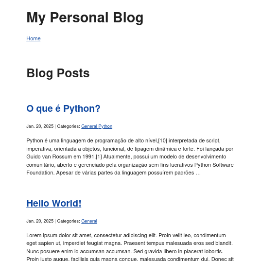

# Personal Blog

**Personal Blog** é uma simples aplicação de exemplo implementando uma
intuitiva lógica de negócio de um blog em [Django Framework](https://www.djangoproject.com/).

Seu objetivo é ser uma aplicação funcional para fins de demonstração de
implantação e boas práticas em DevOps, além, é claro, de poder ser utilizada
como referência também para estudo de Python e Django.



# TOC

<!--toc:start-->

- [Pré-requisitos](#pré-requisitos)
- [Executando](#executando)
<!--toc:end-->

## Pré-requisitos

- Python
- Django
- Docker
- Make

## Executando

1. Clone este repositório

```bash
git clone https://github.com/mfandrade/personal-blog
```

2. Execute-o localmente

```bash
cd personal-blog
make
```

3. Acesse a aplicação no endereço <http://localhost:8080>
